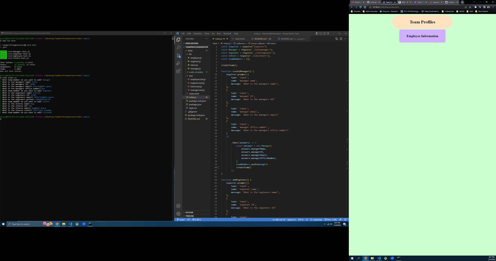

# Team Profile Generator

## Description

In this application, the user will have access to their team's data by inputting it into the console.  The information input there will be sent to an HTML document, where the user will be able to quickly reference their team's information.  There are 3 types of employees, Manager, Engineer and Intern, each with a specific set of questions unique to them.  The videos and screenshot below demonstrate this. 

## Table of Contents

- [Installation](#installation)
- [Usage](#usage)
- [Credits](#credits)

## Installation

Programs necessary for usage is Node.js, but dependencies must be added for it to work.  Inquirer, Jest and Express must be installed into the node_modules folder using, "npm install 'program'".  Finally, this must be run using Node.js, and it cannot be deployed.

## Usage

If one has correctly downloaded the necessary code and has access to what has been written by me, then open the console and navigate to the main folder.  Input "node index.js", and the questionaire will begin.  The user will be provided with 3 profile options and the opportunity to end the function.  When the user selects either Manager, Engineer or Intern, they will be asked for their name, id and email.  If the manager is selected, an extra option for Office Number will appear.  If engineer is selected, the user will be asked for their github account.  If the Intern is selected, the user will be prompted for the intern's school.  In the end, once the team is complete, the user can select, "Finished," and the program will close.  It is at this point when the HTML document would populate with the information, but I will accomplish that later.  All of these functions can be tested using JEST.

## Screenshot

## Links
Video demo of Application: https://youtu.be/24_S0X4-O1o
Video demo of Test: https://youtu.be/CqUoftnJtnw 
Github: https://github.com/mcalcagno47/TeamProfileGenerator  

The site: Not applicable in this situation, as it is running locally

## Credits
Mark Calcagno
Marc Calache, tutor

## Future Development

I hope to return to the document to make the HTML creation work correctly, as at the moment, it is a struggle to collect the data from Node and append the HTML file.  I would also like the CSS to be changed to be more pleasent to the eye.